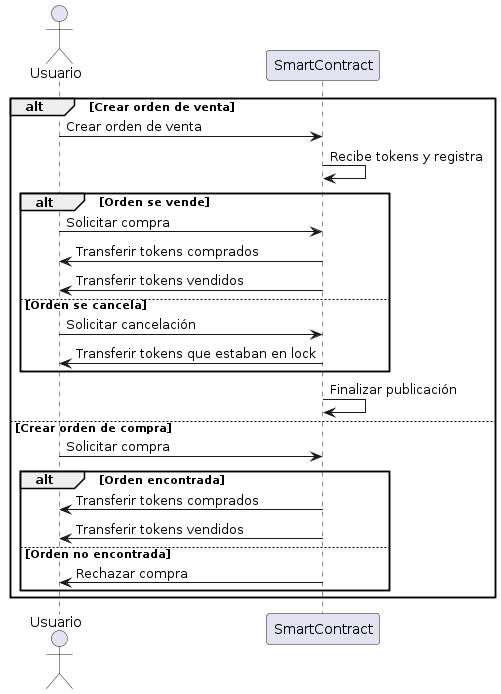

# Proceso de p2pSwap

p2pSwap permite a los usuarios publicar ordenes de venta para que otros usuarios puedan comprarlas.
El proceso de p2pSwap se divide en los siguientes pasos:

## Vendedor

1. El user publica la venta de n tokensA por m tokensB lockeando n tokensA en el contrato.
    - si no hay un mercado para tokenA-tokenB, se crea uno.
    - si ya existe un mercado para tokenA-tokenB, se agrega la publicación a la lista de ordenes de venta.
2. El user espera a que un comprador acepte la orden de venta.
    - si la orden de venta es aceptada, se realiza el swap de tokens.
    - si la orden de venta es cancelada, se elimina de la lista de ordenes de venta y se devuelve el tokenA al vendedor.

## Comprador

1. El user busca una orden de venta que le interese de n tokensA por m tokensB, dando entender que existe el mercado para tokenA-tokenB.
2. El user elige una orden de venta y confirma la compra de n tokensA por m tokensB.

  

# Funciones

**Se omitira los inputs como signer, signature, nonce, funcioens de payMateStaker_... ya que por motivos de metaprotocolo se asume que se implementaran en todas las funciones.**

## Funciones de interacción con el contrato

### Función `makeOrder`
- **Tipo de función:** `public`
- **Input:** address:`tokenA`, address:`tokenB`, uint256:`amountA`, uint256:`amountB`
- **Output:** `idSwap`
- **Recompensa a Fisher:** No aplica

Esta función permite a un usuario publicar una orden de venta en el contrato de p2pSwap. La función recibe como parámetros los tokens involucrados en el swap, la cantidad de tokens a vender y la cantidad de tokens a recibir. La función devuelve el ID de la orden de venta publicada.

Al registar se lockea la cantidad de tokensA en el contrato y en su mapping de ordenes de venta se guarda el id de la orden de venta de ese mercado.

### Función `dispatchOrder`
- **Tipo de función:** `public`
- **Input:** address:`tokenA`, address:`tokenB`, uint256:`idSwap`
- **Output:** 
- **Recompensa a Fisher:** mateReward x 1

Esta función permite a un usuario aceptar una orden de venta publicada en el contrato de p2pSwap. La función recibe como parámetros los tokens involucrados en el swap y el ID de la orden de venta a aceptar.

La función realiza el swap de tokens y devuelve los tokens al vendedor y al comprador.

### Función `cancelOrder`
- **Tipo de función:** `public`
- **Input:** address:`tokenA`, address:`tokenB`, uint256:`idSwap`
- **Output:** No aplica
- **Recompensa a Fisher:** mateReward x 1

Esta función permite a un usuario cancelar una orden de venta publicada en el contrato de p2pSwap. La función recibe como parámetros los tokens involucrados en el swap y el ID de la orden de venta a cancelar.

La función devuelve los tokens al vendedor.

## funciones de consulta

### Función `getSellOrder`
- **Tipo de función:** `public view`
- **Input:** address:`tokenA`, address:`tokenB`, uint256:`idSwap`
- **Output:** `order`
- **Recompensa a Fisher:** No aplica

Esta función permite obtener una orden de venta específica en el contrato de p2pSwap. La función recibe como parámetros los tokens involucrados en el swap y el ID de la orden de venta a consultar. La función devuelve la orden de venta correspondiente al ID.

### Función `getMarket`
- **Tipo de función:** `public view`
- **Input:** address:`tokenA`, address:`tokenB`
- **Output:** `market`
- **Recompensa a Fisher:** No aplica

Esta función permite obtener el mercado de un par de tokens específico en el contrato de p2pSwap. La función recibe como parámetros los tokens involucrados en el swap y devuelve el mercado correspondiente.

### Función `getUserSellOrdersOnMarket`
- **Tipo de función:** `public view`
- **Input:** address:`tokenA`, address:`tokenB`, address:`user`
- **Output:** `orders`
- **Recompensa a Fisher:** No aplica

Esta función permite obtener las órdenes de venta de un usuario en un mercado específico en el contrato de p2pSwap. La función recibe como parámetros los tokens involucrados en el swap y devuelve las órdenes de venta del usuario en el mercado correspondiente.

### Función `getListOfSellOrders`
- **Tipo de función:** `public view`
- **Input:** address:`user`
- **Output:** `listOfSellOrders`
- **Recompensa a Fisher:** No aplica

Esta función permite obtener una lista de todas las órdenes de venta publicadas por un usuario en el contrato de p2pSwap. La función recibe como parámetro la dirección del usuario y devuelve una lista de todas las órdenes de venta publicadas por el usuario.